# fdrive

**fdrive** is a clean web interface for your home server files, built for [SFTPGo](https://github.com/drakkan/sftpgo) first. It connects to your existing SFTPGo storage so you can browse, upload, preview, search, and share your files from any browser, without moving your data into a database or giving up control. fdrive is only a layer on top. 

fdrive also offers a native MacOS app, connecting your SFTPGo files (and other storage providers) directly into Finder.

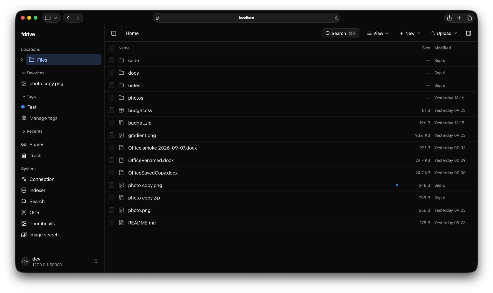

[Explore the screenshots](#screenshots) · [Get started](#quickstart-home-server--lan) · [FDrive for Mac](#fdrive-for-mac)

---

## Highlights

- **Your files stay yours**: Files remain plain files on your disk, managed by SFTPGo. fdrive is just a layer on top, adding more functionality.
- **SFTPGo first, other storage beside it**: Search, thumbnails, shares and Office are built on SFTPGo storage. You can add a WebDAV server or an S3 bucket (MinIO, Garage, Backblaze B2, Cloudflare R2) beside it for browsing and uploads (but these storage providers do not support the features SFTPGo supports).
- **Lightning fast & clean**: Minimalist, distraction-free interface with dark mode, keyboard navigation, and mobile support.
- **Instant previews**: Photos, videos, music, PDFs, markdown, and code files open right in your browser.
- **Smart tags & favorites**: Star items and add custom color tags. They survive renames and moves, even if you rename a file over SFTP or directly on disk.
- **Share with family & friends**: Create password-protected links with expiration dates, download limits, and photo galleries.
- **Trash support build on SFTPGo**: Safely restore accidentally deleted files (if set up)
- **Modular power-ups**: Keep it featherlight (< 300 MB RAM) for basic browsing, or switch on full-text search, AI image search, OCR, and browser office editing whenever you want.

---

## Screenshots

<details>
<summary><strong>Browse and organize files</strong> — file actions, thumbnails, and light mode</summary>

**File actions and tags**

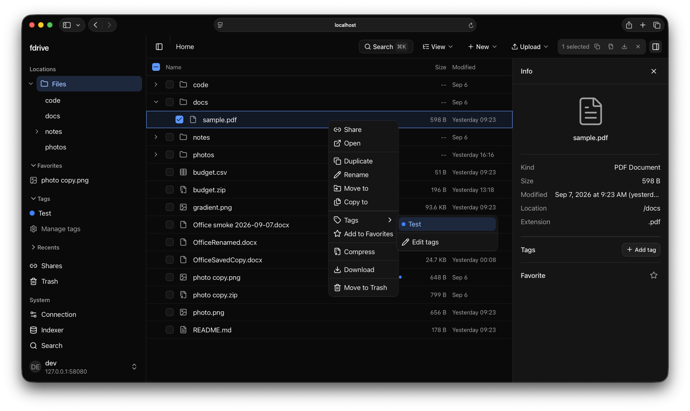

**Thumbnails and view options**

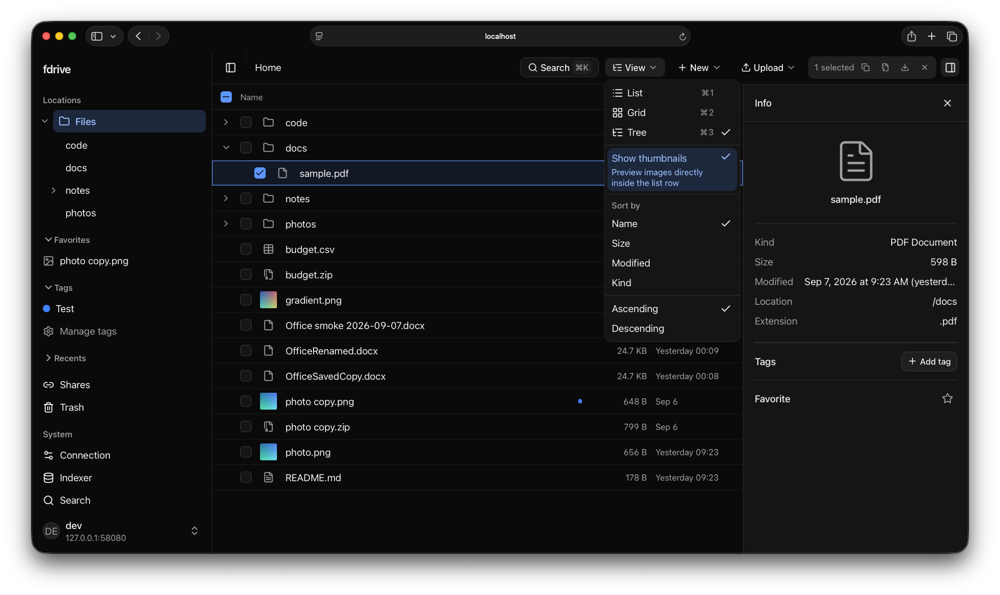

**Light mode**

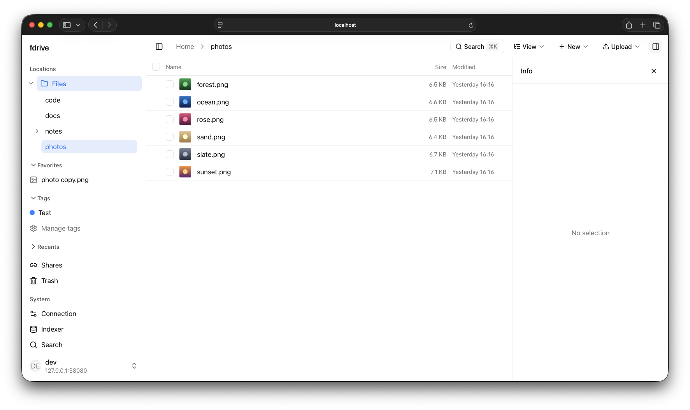

</details>

<details>
<summary><strong>Search</strong> — file contents and AI image search</summary>

**File search**

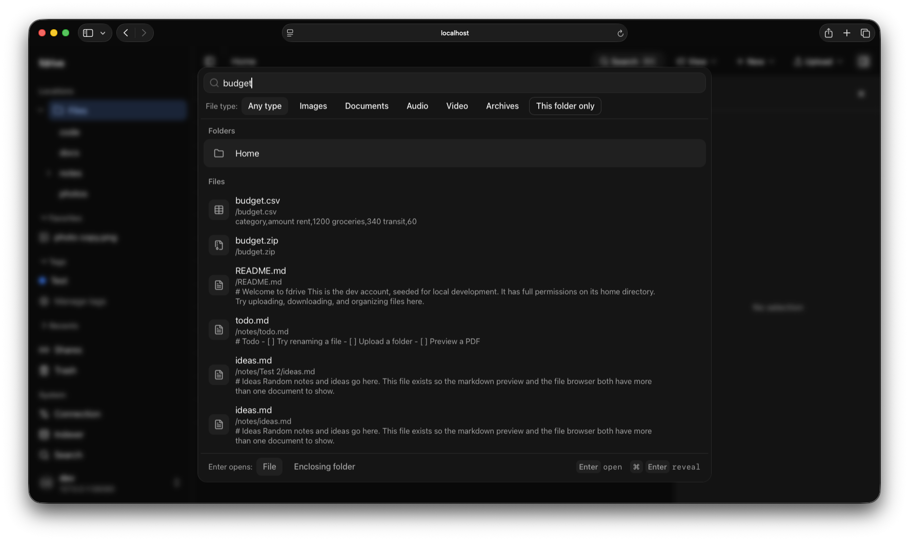

**AI image search**

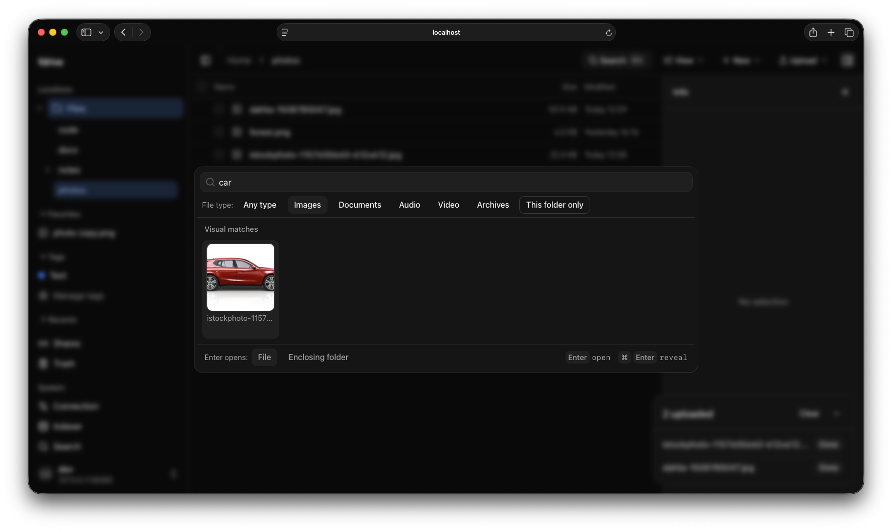

</details>

<details>
<summary><strong>Preview and work with files</strong> — images, code, and Office documents</summary>

**Image lightbox**

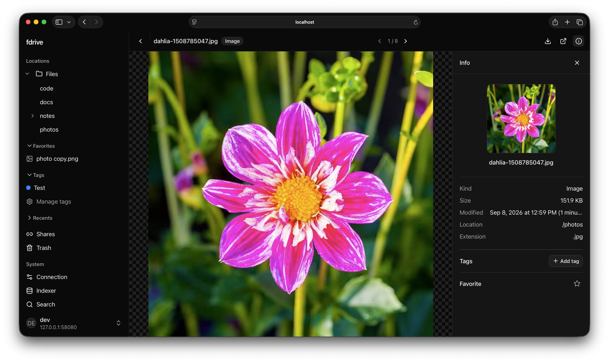

**Code viewer and editing controls**

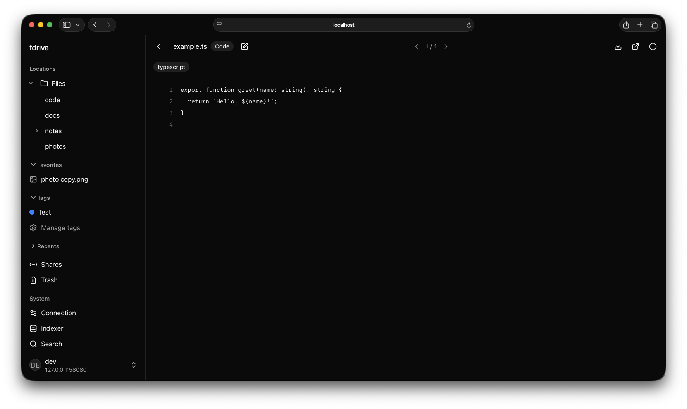

**Office documents with ONLYOFFICE**

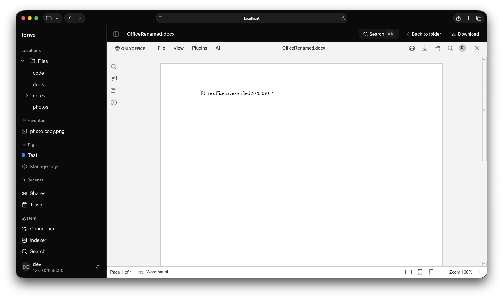

</details>

<details>
<summary><strong>Share and upload</strong> — shared links and upload status</summary>

**Shared links**

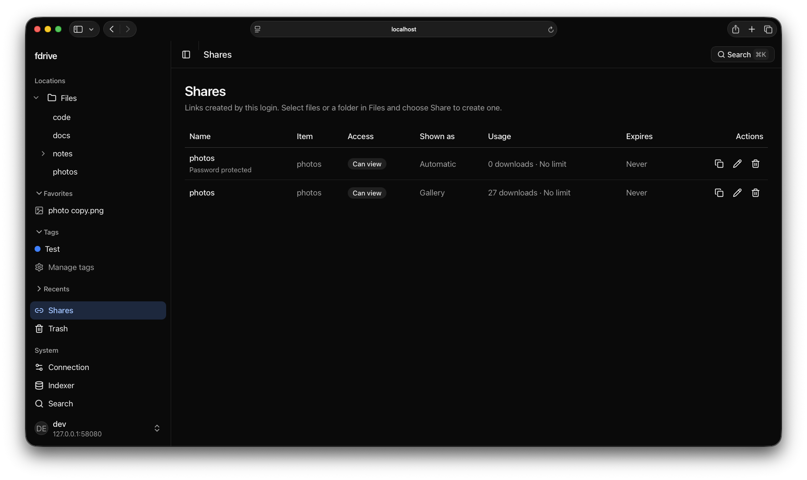

**Upload status**

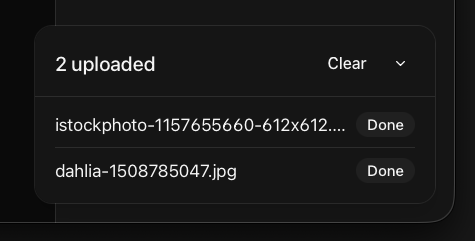

</details>

<details>
<summary><strong>Sign in and administer</strong> — login and image search settings</summary>

**Sign in**

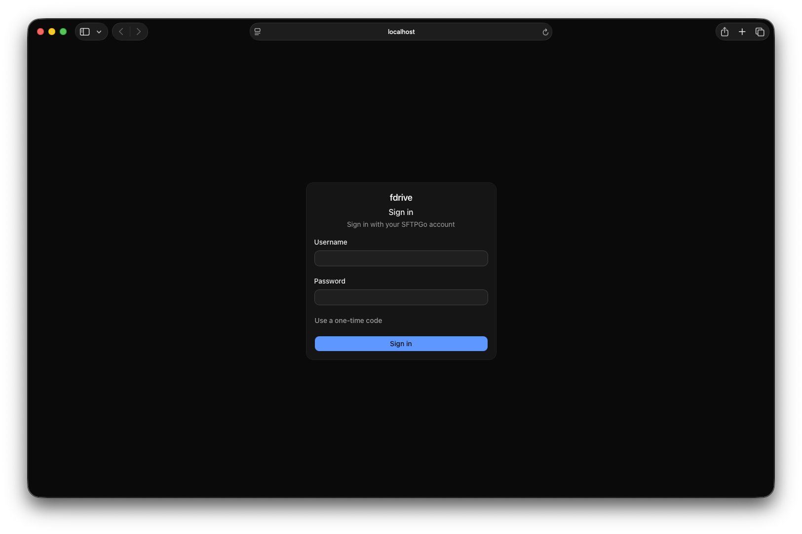

**Image search administration**

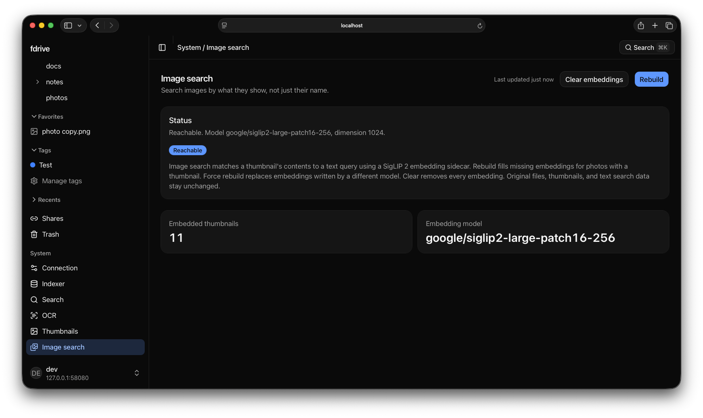

</details>

---

## Quickstart (Home Server / LAN)

You need a Linux server or NAS with Docker (Compose v2) and an SFTPGo server it can reach.
No SFTPGo yet? [Add the bundled one](deploy/REFERENCE.md#bundled-sftpgo). fdrive's images
are published for amd64 and 64-bit ARM, so a Raspberry Pi 4 or 5 on a 64-bit OS, an ARM NAS
or an Apple silicon Mac works as well as a PC.

### 1. Download fdrive and create its secrets

```sh
mkdir fdrive && cd fdrive
curl -fsSLO https://github.com/fredrikburmester/fdrive/releases/latest/download/compose.yaml
test -e .env || printf 'FDRIVE_MASTER_KEY=%s\nPOSTGRES_PASSWORD=%s\n' "$(openssl rand -base64 32)" "$(openssl rand -hex 32)" > .env
```

`test -e .env` checks whether `.env` already exists. That line creates it with two random
secrets only if it doesn't, so it never replaces your keys. Keep `.env` private and back it
up: the master key encrypts stored credentials, and a lost key cannot be recovered. In
Portainer, Dockge or a NAS app, paste `compose.yaml` as a new stack and add the same two
variables instead.

### 2. Point fdrive at your files and start

For thumbnails, search and OCR, first tell the workers where SFTPGo keeps its files, as in
[installation step 2](deploy/README.md#2-mount-sftpgos-files-optional).
Browsing alone needs no mount; the default `./data/roots/sftpgo` is not connected to SFTPGo.

```sh
docker compose up -d
```

The first start downloads about 3 GB of images, including optional workers that stay idle
until you turn their features on. Nothing is compiled on your server.

### 3. Complete the setup walkthrough

From your Mac, phone, or another device on the same network, open **`http://<server-ip>:8090`**. No port-binding or cookie settings are needed. Use the claim token printed in the API log (`docker compose logs api`), test your SFTPGo connection, and verify a normal SFTPGo WebClient account. That account becomes the fdrive administrator; its SFTPGo permissions stay unchanged. Choose optional features in the same setup screen, then finish into your files. Storage checks run automatically for enabled features.

Choose thumbnails, full-text search, search OCR, semantic search, image search, and searchable PDF conversion step by step. Trash follows as a separate optional choice; [configure its SFTPGo recycle-bin rule](docs/TRASH.md) before enabling it. ONLYOFFICE follows as another optional choice, with browser viewing and an explicit editor-user list; see [Office setup](docs/OFFICE.md). Both OCR choices appear in onboarding; PDF conversion has its own toggle because it modifies PDFs. All choices remain editable in **System > Features**. Models and processing stay inactive until enabled.

Browsing needs only a reachable SFTPGo server. Processing also needs its files mounted into the workers during deployment. See the [deployment guide](deploy/README.md) for startup and the [advanced reference](deploy/REFERENCE.md) for host mounts and remote access.

### Updating

```sh
docker compose pull && docker compose up -d
```

This moves to the newest [release](https://github.com/fredrikburmester/fdrive/releases). When a
release changes `compose.yaml`, its notes say so; download the file again first. To stay on
one version, set `FDRIVE_VERSION=0.1.0` in `.env`. See the [deployment guide](deploy/README.md)
for pinning versions and troubleshooting.

---

## FDrive for Mac

**FDrive for Mac** puts your fdrive storage in Finder. Folders appear right away and files
download when you open them, so your Mac does not need a full copy of your drive. Locations you
allow as read and write accept saves on every storage type; see
[how writes are kept safe](docs/MACOS.md#write-configuration-and-recovery).
It is an early release and needs macOS 26 or later on Apple silicon and an fdrive server
reachable over HTTPS. Mac builds are published under
[Releases](https://github.com/fredrikburmester/fdrive/releases) as `macos-v…`; Homebrew
installs the newest:

```sh
brew trust --tap https://github.com/fredrikburmester/fdrive.git
brew tap fredrikburmester/fdrive https://github.com/fredrikburmester/fdrive.git
brew install --cask fredrikburmester/fdrive/fdrive
```

Open FDrive, enter your fdrive web address, sign in and pick the storage logins you want in
Finder. The signed download is **free for 7 days**, then a **one-time €19 license** keeps it
running on up to three Macs. No subscription.

**[Buy a license](https://buy.polar.sh/polar_cl_E2fCqfGdal7FYvVQmjRh38wz4KoT1oMui1quj4R2WJ6)** ·
[Mac guide](docs/MACOS.md) · [Releases and Homebrew](docs/MACOS-RELEASE.md)

Paste the key from your purchase email under **Enter License…**. When the trial ends your
locations pause; downloaded files, pending changes and connections are kept and resume once you
activate. The app is open source like the rest of fdrive, and a build compiled from source has
no trial. The license pays for the signed, notarized build and its development.

---

## Resource Requirements

fdrive is designed to be lightweight by default. You only pay for what you use:

| Setup | Recommended RAM | What you get |
| :--- | :--- | :--- |
| **Core fdrive** | **< 500 MB** | Full file manager, previews, tags, favorites, public shares, and trash. Runs on a Raspberry Pi or low-end NAS. |
| **+ Search & AI** | **~4 GB** | Full-text search inside documents, AI image search (search photos by description), and nightly OCR for scanned PDFs. |
| **+ Office Editing** | **~2 GB** | Collaborative Word, Excel, and PowerPoint editing in the browser via ONLYOFFICE. |

Search & AI is CPU-hungry as well as memory-hungry, and on a shared host that matters more
than the RAM: the indexer, OCR, Tika and the embedding sidecars each ship with bounded
concurrency and optional hard caps. See
[processing worker resource limits](deploy/REFERENCE.md#processing-worker-resource-limits).

---

## Documentation

- 🚀 **[Home Server Setup Guide](deploy/README.md)**: Full step-by-step setup guide, updates and versions, optional add-ons, and LAN configuration.
- 🗑️ **[Trash Setup](docs/TRASH.md)**: Enable safe recycle-bin restore for deleted files.
- 🔍 **[Search, Thumbnails & AI](docs/SEARCH-AND-AI.md)**: How document search, image search, and OCR work.
- 📝 **[Office Documents & Editing](docs/OFFICE.md)**: View and collaboratively edit office files in your browser.
- 🤖 **[AI Assistant Integration (MCP)](docs/MCP.md)**: Connect Claude or Raycast to search and read your files.
- 🔒 **[Advanced Deployment Reference](deploy/REFERENCE.md)**: Custom domain setup, reverse proxies (Caddy / NPM), and security hardening.
- 💻 **[Development Guide](docs/DEVELOPMENT.md)**: Run the dev stack locally and run tests.
- 🏷️ **[Releases](docs/RELEASES.md)**: How server releases and their Docker images are published.
- **[WebDAV](docs/WEBDAV.md) and [S3](docs/S3.md)**: What each storage beside SFTPGo supports today, and what it does not yet.
- **[Adding a Storage Provider](docs/STORAGE-PROVIDERS.md)**: Implement, register and test a backend.

---

## Why fdrive?

Most self-hosted drives either try to replace your filesystem with their own database (like Nextcloud), or they're too barebones to replace Google Drive or iCloud Drive.

fdrive sits right in the sweet spot:
1. **SFTPGo handles storage & protocols**: SFTP, user management, and permissions are handled by SFTPGo, a rock-solid, battle-tested Go server.
2. **fdrive handles the modern web experience**: A polished, responsive browser UI, fast search, document editing, and mobile-friendly links.

That pairing is the product: fdrive is an SFTPGo client first, and the full experience lives there. Other storage is welcome beside it for plain file management. Features that fdrive can provide on its own, without SFTPGo's disk or its share links, reach that storage one at a time; Trash already has.

---

## License

The fdrive server, web interface, native macOS app, and other first-party code in this
repository are licensed under the [GNU Affero General Public License, version 3 only](LICENSE)
(`AGPL-3.0-only`), unless otherwise noted.

Third-party dependencies and storage providers retain their own licenses. Stock
[SFTPGo](https://github.com/drakkan/sftpgo) runs as an external service and is not modified.
